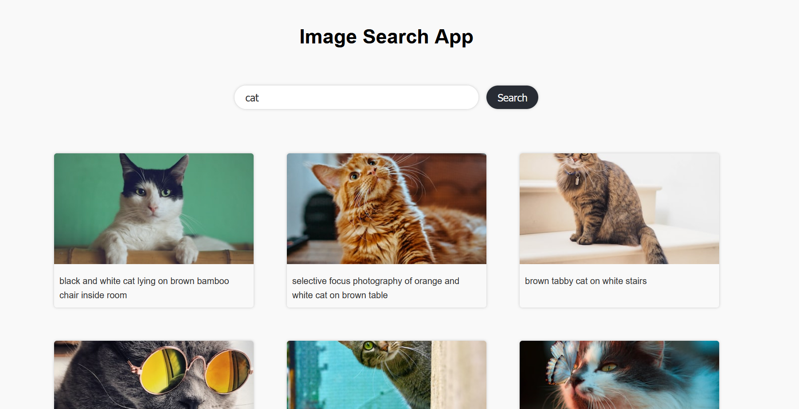

# Image Search Application 

## Introduction
This is an image search application that allows users to search for and browse a vast collection of high-quality images using the Unsplash API. The Unsplash API provides access to a large database of free-to-use images contributed by photographers worldwide.

## Features
- Search for images based on keywords or specific criteria.
- View search results in a visually appealing grid layout.
- Display image details, and click on the link to view the original image and download it.
- Infinite scroll functionality for seamless browsing.
- Responsive design for optimal user experience across different devices.
- Integration with the Unsplash API for real-time and up-to-date image data.

## Technologies Used
- HTML, CSS, JavaScript for front-end development.
- Unsplash API for fetching image data.
- Fetch API or AJAX for making HTTP requests to the Unsplash API.
- Responsive design techniques for creating a mobile-friendly layout.
- Any modern web browser for running the application.

## Installation and Setup
1. Clone the repository: `git clone https://github.com/melbin.koshy/image-search-app.git`
2. Navigate to the project directory: `cd image-search-app`
3. Open the `index.html` file in your preferred web browser.

## Usage
1. Open the application in your web browser.
2. Enter keywords or criteria for the desired image in the search bar.
3. Press the search button or hit Enter to initiate the search.
4. The application will retrieve and display the relevant images.
5. click on show more to load more images (if available) or refine your search query.
6. Click on an image to view its details and download options.
7. Explore the application and enjoy browsing high-quality images!

## API Key
To use the Unsplash API in this application, you need to obtain an API key from Unsplash. Follow the steps below:

1. Create an account on [Unsplash](https://unsplash.com/join).
2. Navigate to the [Unsplash API documentation](https://unsplash.com/documentation) page.
3. Register as a developer and create a new application.
4. Obtain your API key.
5. In the application code, replace the placeholder `YOUR_UNSPLASH_API_KEY` with your actual API key.

## Troubleshooting
- If the application is not functioning as expected, make sure you have a stable internet connection.
- Double-check that your API key is correctly entered in the code.
- Review the Unsplash API documentation for any recent changes that might affect the application.

## Contributing
Contributions are welcome! If you find any issues or have suggestions for improvements, please feel free to submit a pull request or open an issue in the project repository.

